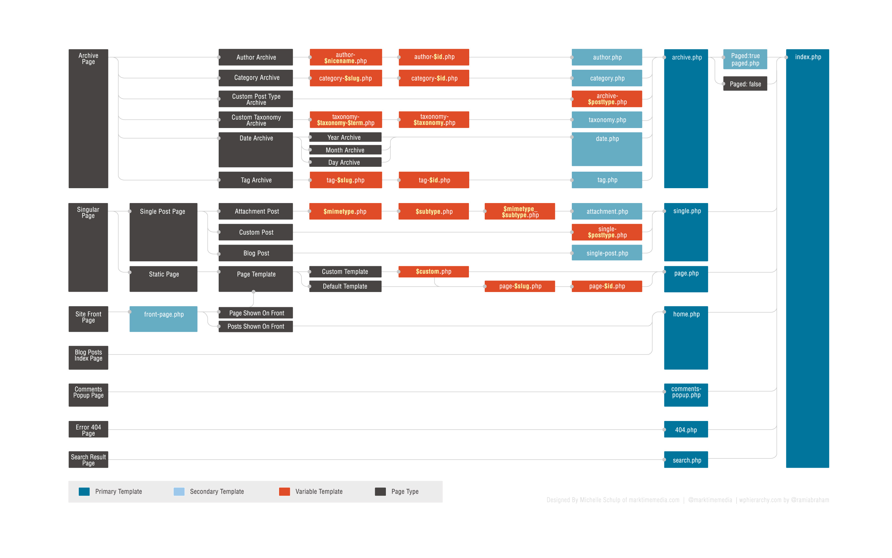

# Les templates de base

Les templates sont les fichiers qui permettent d'afficher un type de contenu (articles, pages, etc...).
Ceux de base sont automatiquement repérés par WordPress.

## [index.php](../index.php)

[index.php](../index.php) est le template de base dans WordPress, cependant vous pouvez en
créer d’autres en fonction de votre structure de page. 

Si aucun des templates de la hiérarchie ne correspond, ce sera ce fichier qui sera choisi.

**Ce fichier est obligatoire!**

## [home.php](../home.php)

[home.php](../home.php) est le template qui permet d'afficher la page d'accueil et **la liste d'article non trié à ne pas confordre avec** [archive.php](../archive.php)

## [archive.php](../archive.php)

[archive.php](../archive.php) est le template qui permet d'afficher une liste triée d'éléments tels que les articles, catégorie, etc...
Imaginons que dans le site, il y a une page blog avec une liste des actualités de votre site, c'est [archive.php](../archive.php) qui sera utilisé.

## [single.php](../single.php)

[single.php](../single.php) est le template qui permet d'afficher un article en particulier.
Imaginons que l'on navigue dans la liste d'article et que l'on clique pour voir plus de detail sur un article, le template utilisé pour afficher cette article sera [single.php](single.php).

## [page.php](../page.php)

[page.php](../page.php) est le template qui permet d'afficher une page en particulier.
Imaginons que l'on clique sur un lien d'une page dans le site afin de voir les détails de cette page, le template utilisé afficher cette page sera [page.php](page.php).

# La hierarchie des templates de base

La hierarchie des templates dans WordPress est très importante, elle décide quel template utiliser.

Exemple :

Pour une catégorie, le template utilisé est category-$slug.php (slug est le nom de la catégorie)

---

[:back:](structure.md) | [:soon:](analyse-template.md)