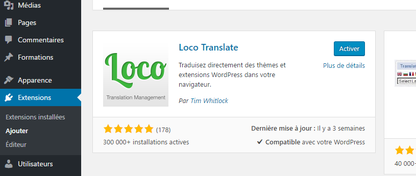
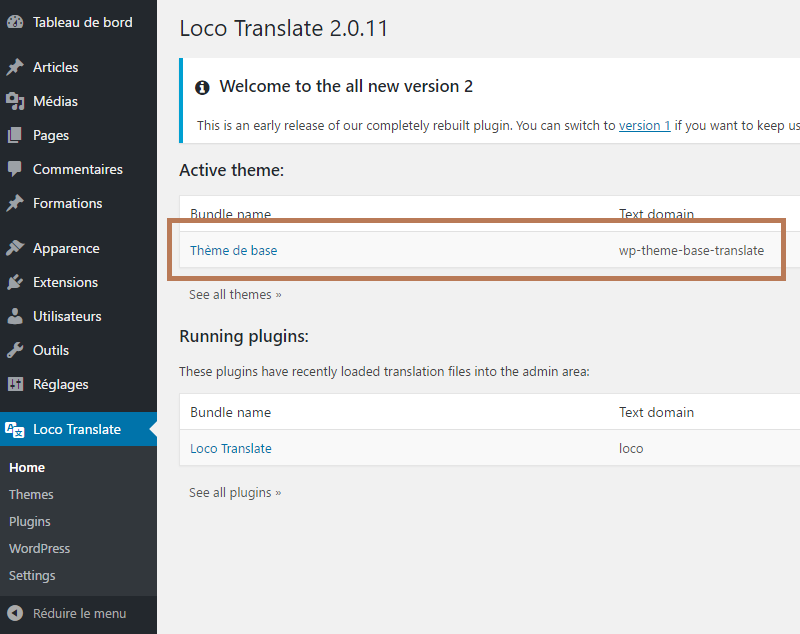
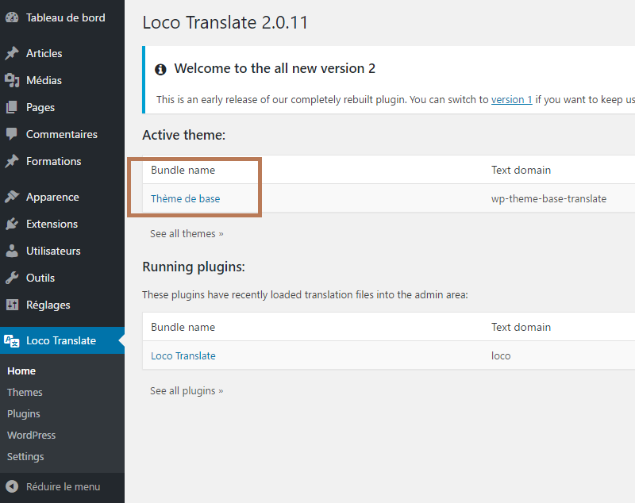
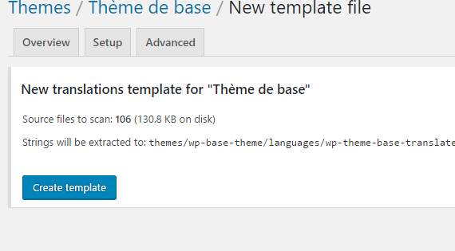
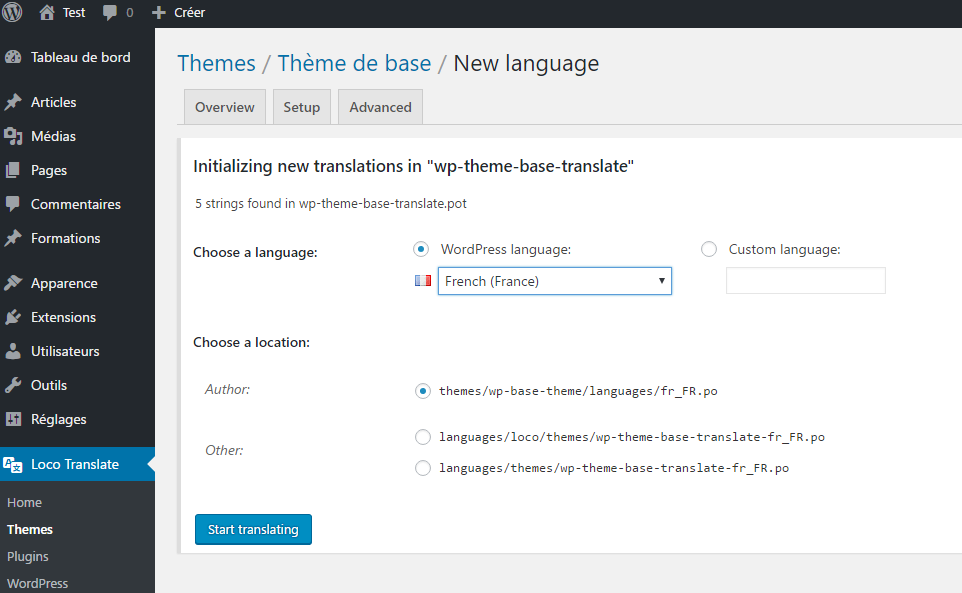
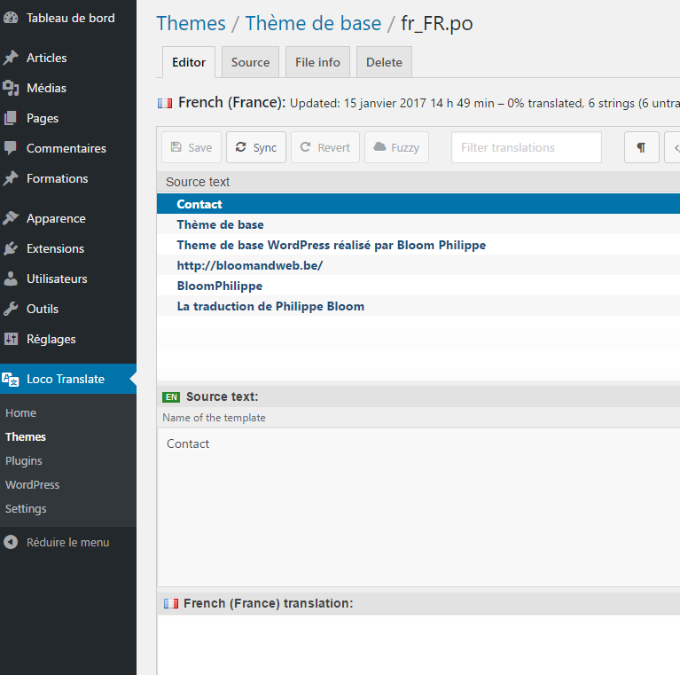
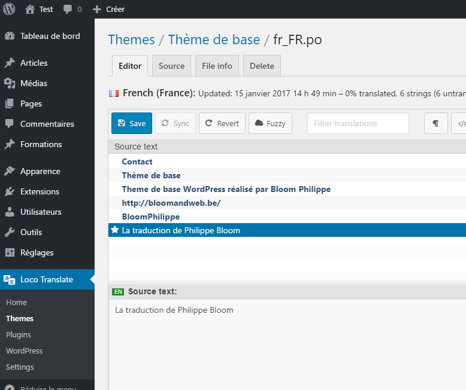

# Traduire un template

Dans les templates, vous avez souvent du texte non éditable par l'administrateur du site ou le client.

Il est préférable de rendre traductible ce genre de texte car si un jour votre site doit être traduit, cela vous évitera de repasser sur tous les template.

## Etapes

### 1. Ajouter un domaine de texte

Le première étapes est de signaler à WordPress que votre thème possède des fichiers de traduction.
Généralement, le thème possède un dossier languages dans lequel va être placé vos fichier de traduction (.po et .mo).
 
Il y as deux manières d'effectuer ce signalement, via style.css ou via functions.php. 

La méthode via le style.css prendra le pas sur l'autre, elle a plus d'impact.

#### Via le [styles.css](../style.css)

```
Text Domain:    wp-theme-base-translate
```

wp-theme-base-translate permet au moment d'afficher une traduction, de dire à WordPress où trouver les traductions...
Avec cette méthode, WordPress va chercher vos traduction dans wp-content/languages/themes .

**Je déconseille cette méthodes car si vous avez besoin de ce theme sur plusieurs site, il faudra créer à nouveau vos traductions!**
**Donc si la ligne "Text Domain" se trouve dans votre thème, supprimer-la !**

#### Via le [functions.php](../functions.php)

Grâce au code ci-dessous, vous signalez à WordPress qu'il doit vérifier dans le dossier 
languages de votre thème pour trouver les traductions lié au thème.

**Cette manière ne sera pas prise en compte si vous l'avez déjà ajouté dans le** [styles.css](../style.css)

```
add_action( 'after_setup_theme', 'pdw_theme_setup' );

function pdw_theme_setup(){
    load_theme_textdomain( 'wp-theme-base-translate', get_template_directory() . '/languages' );
}
```

**add_action()** permet de signaler à WordPress qu'il doit executer votre fonction à un moment précit.

le premier paramètre est le moment que WordPress doit executer votre fonction
Ce moment est un fonction native de WordPress qui s'execute à un moment précit et donc le add_action() va dire à WordPress :

"Lorsqu'il execute la fonction after_setup_theme, il execute la fonction pdw_theme_setup juste après"

Le deuxième paramètre est le nom de votre fonction à executer

**load_theme_textdomain()** permet d'ajouter des nouveaux fichiers de traduction (po et mo)


Le premier paramètre est le slug parent de vos traductions grâce au quel WordPress sait où trouver vos fichiers.

Le deuxième paramètre est le chemin vers le dossier où se trouve vos traduction


### 2. Ajouter un plugin pour créer ou modifier vos fichiers po et mo

Vos traductions sont dans deux fichiers dans les .mo et .po.

Les fichiers .mo sont en format binaire qui sont lu par WordPress pour trouver les traductions, ces fichiers sont illisible pour l'homme. 
Ils sont générés à partir d'un fichier .po.

Les fichiers .po permettent de créer et de modifier vos traductions.
Ils sont ensuite transformés en fichier .mo.

Exemple d'une partie d'un fichier .po pour le français:

```
msgid "more"
msgstr "plus"
```

Exemple d'une partie d'un fichier .po pour l'anglais:

```
msgid "more"
msgstr "more"
```

Dans vos templates, seule msgid sera utilisé.
Si votre site est en français, WordPress va chercher dans le fichier fr_FR.mo à quoi correspond "more"
Si votre site est en anglais, WordPress va chercher dans le fichier en_EN.mo à quoi correspond "more"


Il y a plusieurs manière de modifier ces fichiers, via un plugin comme Loco Translate ou via PoEdit que est un logiciel de traduction.

- Installer Loco Translate



- Aller dans l'onglet Loco Translate, vous pouvez constater qu'il a repéré que votre thème à un emplacement pour des traductions.



- Cliquer sur le nom de votre thème



- Cliquer sur Create template


- Cliquer encore sur Create template

Créer un template permet de créer un fichier .pot qui sera une base pour vos futurs .po.
Il possèdera l'ensemble de vos clé de traduction (msgid) ainsi vous n'auraez pas besoin de les écrire à chanque fichier .po (fr, en, nl, etc...)



- Cliquer sur New language pour ajouter un nouveau fichier de traduction pour une langue (.po) à votre thème


- Selectionner la langue (pour l'exemple français) et choisir la location (emplacement) de votre thème



- Cliquer sur Start tanslating et vous arriverez dans l'interface qui permet de traduire vos clé (msgid) et de générer vos fichiers .mo



- Dés que vous aller modifier une traduction, le bouton Save va changer de couleur, n'oubliez pas de cliquer dessus afin de mettre à jour le fichier .mo.



- Faite pareil pour chaque langue !

### 3. Ajouter vous tranductions dans vos templates

Exemple de code ci-dessous que vous pouvez trouver dans [header.php](../header.php) :

```
<?php _e('La traduction de Philippe Bloom', 'wp-theme-base-translate'); ?>
```

**_e()** signale à WordPress que le texte est traductible et effectue un echo.

Le premier paramètre est l'identifiant du texte (msgid) à aller chercher qui se trouve dans un fichier de traduction

Le deuxième paramètre est le domaine de vos traductions ainsi WordPress sait dans quel dossier vérifier.

### 3. Visualiser et tester le changement de traduction

- Actuellement mon site est en français donc "La traduction de Philippe Bloom" est égale à sa valeur en français


- Aller dans le backoffice, dans réglages (settings), dans l'onglet générale et changer la langue du site


- Cliquer sur enregistrer et retourner sur le front


### Liens utiles : 

- Formation sur la traduction d'une application PHP, [cliquer ici](https://www.grafikart.fr/tutoriels/php/internationaliser-site-gettext-104)
- Formation sur la traduction d'une application PHP, [cliquer ici](http://tassedecafe.org/fr/internationaliser-site-web-php-gettext-2878)
- Pour plus d'informations, [cliquer ici](http://blog.nalis.fr/?post/2011/02/08/traduction-et-multilinguisme-d-un-site-web-%3A-Gettext-et-poedit-tutoriel-et-exemple)
- Pour plus d'informations, [cliquer ici](https://developer.wordpress.org/themes/functionality/localization/)


---

[:back:](menu.md) | [:soon:](widget.md)